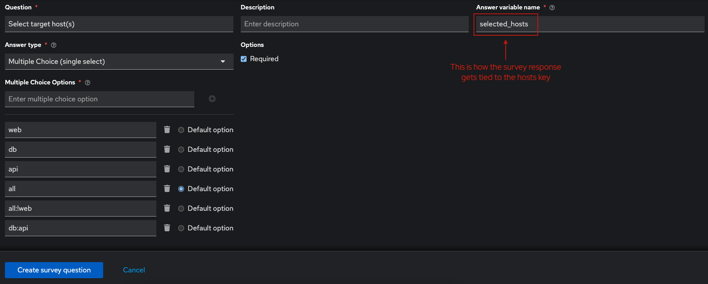
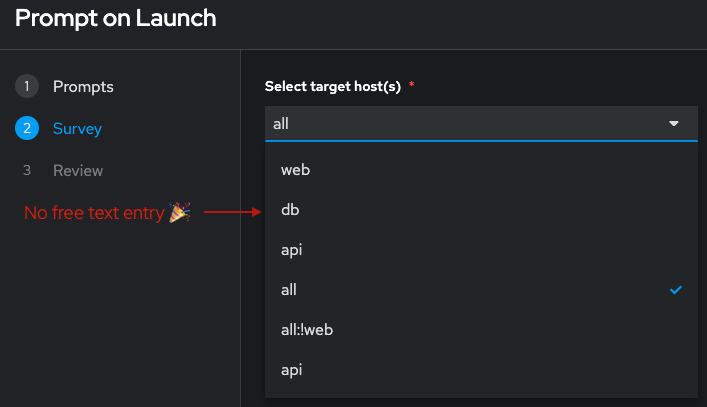

# Parameterized Hosts Key

Every Ansible playbook has a hosts entry for each play (many playbooks have a single play). It's not always obvious that we can parameterize the value to target a dynamic set of hosts within the specified inventory. This is an alternative to using ansible_limit and offers more flexibility because you could use both in tandem if desired.

## Example Playbook

```yaml
---
- name: Example using parameterized hosts
  hosts: "{{ selected_hosts }}"
  
  tasks:
    - name: Debug hostname
      ansible.builtin.debug:
        msg: "{{ inventory_hostname }} was selected"
```

## Example Survey

If you want to prevent end users from having to enter free text, then you can use Surveys in Ansible Automation Platform to define a dropdown list with predefined subsets. The options can be any valid use the patterns to define hosts/groups, see examples [here](https://docs.ansible.com/ansible/latest/inventory_guide/intro_patterns.html).

Below is a basic survey question I put together to inject the hosts value into the playbook above:
<br><br>


Keep in mind, for this to work as expected the associated inventory would need to be comprised of the relevant host/group combinations. Below is a screenshot of the end user experience:
<br><br>
