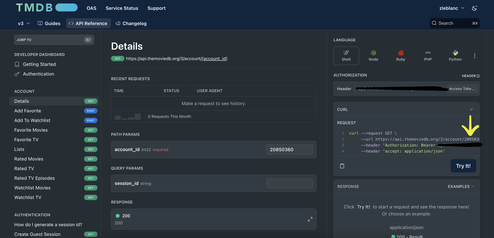

# From any API to URI

This playbook demonstrates how you can integrate with any API using the Ansible URI module. To make the example interesting, I am using The Movie Database (TMDB) API. I will show how you can leverage the `register` capability of tasks to generate a session id which requires multiple API calls. Once the session id is generated, I will pull user specific information from the API. In a future demo, I will wrap the URI usage in a custom module with idempotency to get the optimal Ansible experience.

⚠️ *Note: This guide is intentionally verbose and not meant for users who have prior experience with Ansible and the URI module to interact with APIs.*

## using credentials

To get a session id, you will need an application api key and the relevant user's login. Follow the instructions [here](https://www.themoviedb.org/settings/api) to create an application and save the api key. When developing, I generally create a python virtual environment at the root of my repository and set environment variables. Using this method, I don't have to worry about accidentally publishing my credentials to GitHub (or any other SCM) and I can easily translate this to a playbook run in Ansible Automation Platform (AAP) with Custom Credential Types. I will explain how to create the Credential Type, but for now follow the steps below to setup your virtual environment:

1. At the root of your repo, run `python3 -m venv .venv`
2. Ensure you have a `.gitignore` at the root of your repository with a `.venv` entry
3. Open the activate script `.venv\bin\activate` and make the following updates:
   - Add the following lines to the **end of the file**:
      ```bash
        ...
        export TMDB_API_KEY="<your-tmdb-api-key>"
        export TMDB_USERNAME="<your-tmdb-username>"
        export TMDB_PASSWORD="<your-tmdb-password>"
        (EOF)
      ```
   - Add these lines to the end of the `deactivate` function:
      ```bash
        deactivate() {
          ...
          unset TMDB_API_KEY
          unset TMDB_USERNAME
          unset TMDB_PASSWORD
        }
      ```
    - These changes handle setup and tear down of necessary environment variables for interacting with the TMDB API. I prefer this method for local development because it mimicks how Credentials are injected into AAP jobs.

## complete the authentication flow with uri

There are three steps to generating a session id:
1. Create a request token
2. Validate the token with a user login
3. Create a new session

First, we will define a few variables for authentication purposes:
```yaml
  vars:
    tmdb_api_url: "https://api.themoviedb.org/3"
    tmdb_account_id: "20850360"
    tmdb_api_key: "{{ lookup('env', 'TMDB_API_KEY') }}"
    tmdb_username: "{{ lookup('env', 'TMDB_USERNAME') }}"
    tmdb_password: "{{ lookup('env', 'TMDB_PASSWORD') }}"
```

The first two are hardcoded and contain no secrets, they could be overriden as `extra_vars` at runtime. The last three are optional as you could use the lookup inline anytime you need to reference these values, but I prefer to create ansible variables for better readability.

Now, we complete each step with the `ansible.builtin.uri` module and register necessary output to chain together each request:

1. Create a request token using our API KEY and register it to `r_req_token`
    ```yaml
    - name: Create request token
      register: r_req_token
      ansible.builtin.uri:
        url: "{{ tmdb_api_url }}/authentication/token/new?api_key={{ tmdb_api_key }}"
        method: GET
    ```
    The result will contain a json key with the response payload, like this:
    ```json
    {
      "json": {
        "success": true,
        "expires_at": "2023-12-24 17:19:16 UTC",
        "request_token": "199b841dcdd4e99f09b..."
      },
      ...
    }
    ```
    We can then use the access the request token via `{{ r_req_token['json']['request_token'] }}`

2. Validate the token with an actual user login from our variables described [above](#using-credentials)
    ```yaml
    - name: Validate token with login
      ansible.builtin.uri:
        url: "{{ tmdb_api_url }}/authentication/token/validate_with_login?api_key={{ tmdb_api_key }}"
        method: POST
        body_format: json
        body:
          username: "{{ tmdb_username }}"
          password: "{{ tmdb_password }}"
          request_token: "{{ r_req_token['json']['request_token'] }}"
    ```
    ⚠️ *Note the use of our previously created request token by referencing the registered var*
    - The response from this request is not required to complete the authentication flow, so I omit the register keyword from this task.
    - The **body_format** parameter instructs ansible to convert the **body** to json and set the Content-Type header for this request to `application/json`.
  
3. The final step creates a new session with the validated token 
    ```yaml
    - name: Create session
      register: r_session
      ansible.builtin.uri:
        url: "{{ tmdb_api_url }}/authentication/session/new?api_key={{ tmdb_api_key }}"
        method: POST
        body_format: json
        body:
          request_token: "{{ r_req_token['json']['request_token'] }}"
    ```
    The result will contain a json key with the response payload, like this:
    ```json
    {
        "success": true,
        "session_id": "05be09af5a72ec087ad..."
    }
    ```
    Register the response to leverage the session_id for future requests via `{{ r_session['json']['session_id'] }}`

✅ The authentication flow is complete, we can now use the TMDB API as our validated user until the session expires.

## use the API with authenticated privileges

The last part of the playbook will pull user-specific data from the TMDB API, something you can't do without completing the authentication process above. You will need to find your account id to build the url for these requests, which can be done by logging into TMDB and navigating to the [Account Details API documentation](https://developer.themoviedb.org/reference/account-details).



Once you have identified your Account ID, put it in a variable or pass it in as an extra var. In this example, I use `tmdb_account_id`.

Following the authentication tasks, I do a quick set_fact so I can reuse the same query parameters and keep the playbook concise. Many APIs will have you pass in a token (or some other form of authentication) via the Authorization header, but the TMDB API uses query params. No problem for Ansible, just build the query string - in this case, we pass the api key and newly generated session id.

```yaml
- name: Set auth query
  ansible.builtin.set_fact:
    tmdb_auth_query: "api_key={{ tmdb_api_key }}&session_id={{ r_session['json']['session_id'] }}"
```

Now we can access user data within Ansible! The task used to demonstrate gets the user's favorited movies:

```yaml
- name: Get favorite movies
  register: r_fav_movies
  ansible.builtin.uri:
    url: "{{ tmdb_api_url }}/account/{{ tmdb_account_id }}/favorite/movies?{{ tmdb_auth_query }}"
    method: GET
```

At this point, you can further build out the playbook to leverage other endpoints based on the [TMDB API documentation](https://developer.themoviedb.org/reference/intro/getting-started). This is the **same** process I follow to integrate Ansible with any new APIs I come across.

## extra: use json_query to transform the response data

You will often receive more data than necessary from an unfiltered API response. Sometimes APIs allow you to pass query parameters to reduce the complexity of the response payload and apply transformations server side, but in this case we will have to filter it on the Ansible side. Ansible leverages a python library, **jmespath**, to apply *queries* against JSON objects.

For example, lets simplify the list of favorite movies down to a simple list of titles.

### raw response

```json
{
    "page": 1,
    "results": [
        ...,
        {
            "adult": false,
            "backdrop_path": "/fm6KqXpk3M2HVveHwCrBSSBaO0V.jpg",
            "genre_ids": [
                18,
                36
            ],
            "id": 872585,
            "original_language": "en",
            "original_title": "Oppenheimer",
            "overview": "The story of J. Robert Oppenheimer's role in the development of the atomic bomb during World War II.",
            "popularity": 601.492,
            "poster_path": "/8Gxv8gSFCU0XGDykEGv7zR1n2ua.jpg",
            "release_date": "2023-07-19",
            "title": "Oppenheimer",
            "video": false,
            "vote_average": 8.129,
            "vote_count": 5562
        },
    ],
    "total_pages": 1,
    "total_results": 3
}
```

### json_query

The response contains a **list** of movie objects in the **results** key. So how do we convert that to a list of movie titles, using Ansible, in a succinct manner? Let's use the `ansible.builtin.json_query` filter plugin. Recall that the response is saved to `r_fav_movies`.

```yaml
- name: Debug favorite movies
  ansible.builtin.debug:
    msg: "{{ r_fav_movies.json | json_query('results[].title') }}"
```
... which results in ...
```json
[
  "Oppenheimer",
  "Wonka",
  "Fight Club"
]
```
How does it work?
- the first part of the query `results[]` creates a list project for each element in the JSON array
- the following expression is then applied to each element, in this case we simply return the `title`

What if I want multiple properties? No problem, the second part of the query just changes a bit. Instead of simply returing the title, you would define an object with the keys of interest: `{title: title, release: release_date}`. A few things to note:
- You can change the key in your expression, I left **title** as-is but set the **release_date** value to **release**.
- The curly braces are used to denote an object, necessary in this example because we have multiple properties
- The full query would be: `json_query('results[].{title: title, release: release_date}')`
- The result would look like:
    ```json
    [
      {
        "title": "Oppenheimer",
        "release": "2023-07-19"
      },
      {
        "title": "Wonka",
        "release": "2023-12-06"
      },
      {
        "title": "Fight Club",
        "release": "1999-10-15"
      }
    ]
    ```

Forming the json_query can take some practice, but the library is powerful and you can implement complex transformations if neccessary. To avoid wasting cycles on a trial-and-error approach, leverage the [online jmespath tester](https://jmespath.org/tutorial.html) to get instant feedback on your query before plugging it into Ansible. This online resource has plenty of examples and allows you to input a sample dataset and build queries against it - with instant feedback. I have saved myself countless hours using this site 😅

## what next?

Now that you are comfortable integrating Ansible with third-party APIs, you can start writing custom modules to manage these resources. Developing custom modules will allow you to share the work you have done so that others can easily consume the same APIs. Additionally, you can implement idempotency in your modules and take full advantage of Ansible's ability to achieve and maintain a desired state, only making changes when necessary. 

Come back later for a link to a future post covering custom module development, continuing the TMDB example...